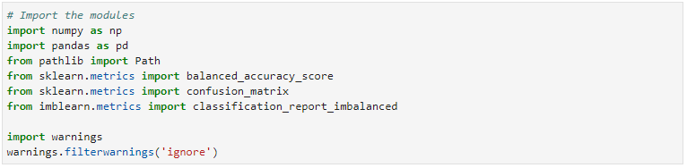

# Credit Risk Classification

___
For this project, I will try to create a model that can identify the creditworthiness of borrowers using a dataset of historical lending activity from a peer-to-peer lending services company. This will require training and evaluating models with imbalanced classes.

---

## Technologies

This project leverages python 3.7 with various Libraries and IDE:

* [Imbalanced Learn](https://pypi.org/project/imbalanced-learn/) - a python package offering a number of re-sampling techniques commonly used in datasets showing strong imbalance between classes.

---

## Installation Guide

In order to run the application, one should install the following:

* Install Imbalanced-Learn

---

## Usage
To use the analysis, clone the repository and run the credit_risk_resampling.ipynb file.

---

## Contributors

Franco Thomas - francothomas1989@gmail.com

---

## License

MIT